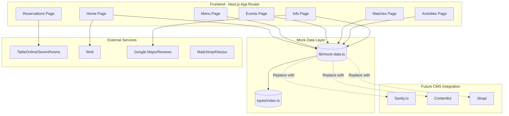
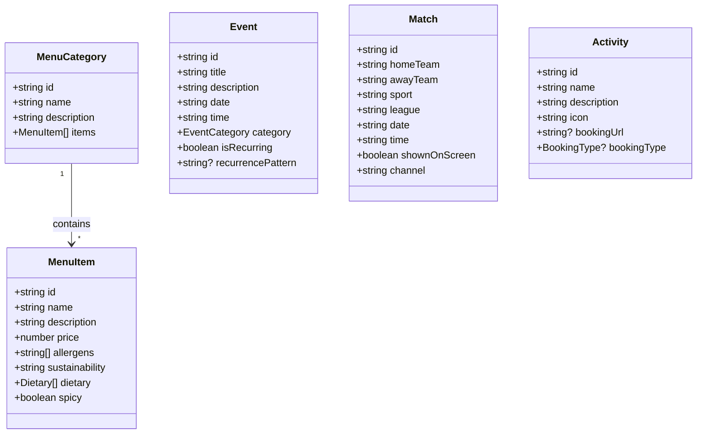
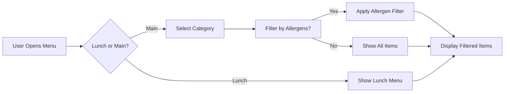
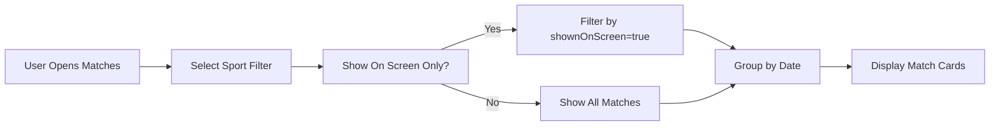

# Restaurant Website - Mockup & Documentation

A complete restaurant website mockup built with Next.js, featuring menu with allergen filtering, events calendar, match schedule, activities, and reservations integration.

## 🚀 Quick Start

```bash
# Install dependencies
npm install

# Run development server
npm run dev

# Open in browser
# http://localhost:3000
```

---

## 📋 Project Overview

### Features Implemented

| Feature | Status | Description |
|---------|--------|-------------|
| **Information Pages** | ✅ Complete | Restaurant info, hours, map, contact, accessibility |
| **Digital Menu** | ✅ Complete | Lunch + Main menu, allergen filtering, dietary icons, sustainability badges |
| **Events Calendar** | ✅ Complete | Event cards, category filtering, add to calendar/share |
| **Match Schedule** | ✅ Complete | Sports calendar, filter by sport, "shown on screen" indicator |
| **Activities** | ✅ Complete | Darts, billiards, F1 sims, VIP, kids' playroom with booking links |
| **Reservations** | ✅ Complete | TableOnline/SevenRooms embed ready |
| **Wolt Integration** | ✅ Complete | Direct ordering button |
| **Multilingual** | 🚧 TODO | Finnish/English toggle |
| **Google Reviews** | 🚧 TODO | Embedded reviews widget |
| **Newsletter** | 🚧 TODO | Mailchimp/Klaviyo form |
| **Loyalty Program** | 🚧 TODO | Digital loyalty system |
| **Online Store** | 🚧 TODO | Merch and gift cards |

---

## 🏗️ Architecture



---

## 📁 File Structure

```
restaurant/
├── app/
│   ├── page.tsx              # Home page
│   ├── menu/
│   │   └── page.tsx          # Menu with allergen filtering
│   ├── events/
│   │   └── page.tsx          # Events calendar
│   ├── matches/
│   │   └── page.tsx          # Sports match schedule
│   ├── activities/
│   │   └── page.tsx          # Activities & booking
│   ├── info/
│   │   └── page.tsx          # Location, accessibility, contact
│   ├── reservations/
│   │   └── page.tsx          # TableOnline/SevenRooms embed
│   ├── layout.tsx            # Root layout
│   └── globals.css           # Global styles
├── lib/
│   └── mock-data.ts          # ⭐ All mock data (edit this!)
├── types/
│   └── index.ts              # TypeScript types
├── public/                   # Static assets
├── package.json
└── README.md                 # This file
```

---

## 📝 How to Edit Content

### 1. Restaurant Info (Name, Hours, Contact)

Edit `lib/mock-data.ts` → `restaurantInfo`:

```typescript
export const restaurantInfo = {
  name: "Your Restaurant Name",
  tagline: "Your tagline here",
  address: {
    street: "Your Street 12",
    city: "Helsinki",
    postalCode: "00100",
    country: "Finland"
  },
  hours: {
    monday: { open: "11:00", close: "23:00" },
    // ... other days
  },
  contact: {
    email: "your@email.com",
    phone: "+358 10 123 4567",
    socials: {
      instagram: "https://instagram.com/yourrestaurant",
      facebook: "https://facebook.com/yourrestaurant"
    }
  }
};
```

### 2. Menu Items

Edit `lib/mock-data.ts` → `mainMenu` or `lunchMenu`:

```typescript
{
  id: "burger-1",
  name: "Burger Name",
  description: "Tasty description",
  price: 19.90,
  allergens: ["gluten", "milk", "eggs"],
  sustainability: "Local beef from nearby farms",
  dietary: ["vegetarian"], // or ["vegan"] or []
  spicy: false
}
```

#### Available Allergens
```typescript
allergens: [
  "gluten",    // GL
  "milk",      // M
  "eggs",      // EG
  "fish",      // F
  "shellfish", // S
  "soy",       // SO
  "celery",    // C
  "mustard",   // MU
  "sesame",    // SE
  "lupin",     // L
  "mollusk",   // MO
  "nuts",      // N
  "peanuts"    // P
]
```

### 3. Events

Edit `lib/mock-data.ts` → `events`:

```typescript
{
  id: "event-1",
  title: "Quiz Night",
  description: "Test your knowledge!",
  date: "2026-04-05",  // YYYY-MM-DD
  time: "19:00",       // HH:MM
  category: "quiz",    // quiz, concert, bingo, sports-viewing
  isRecurring: true,
  recurrencePattern: "Every Wednesday",
  image: "/events/quiz.jpg",
  requiresBooking: false
}
```

### 4. Matches

Edit `lib/mock-data.ts` → `matches`:

```typescript
{
  id: "match-1",
  homeTeam: "Finland",
  awayTeam: "Sweden",
  sport: "ice-hockey",
  league: "Liiga",
  date: "2026-04-05",
  time: "18:30",
  shownOnScreen: true,  // Will show at restaurant
  channel: "TV2"
}
```

### 5. Activities

Edit `lib/mock-data.ts` → `activities`:

```typescript
{
  id: "activity-darts",
  name: "Darts",
  description: "Professional dart boards available",
  icon: "🎯",
  bookingUrl: "https://booking-site.com/darts", // or null
  bookingType: "external", // "external", "email", or null
  hasBooking: true
}
```

### 6. External Integrations

Edit `lib/mock-data.ts` → `integrations`:

```typescript
export const integrations = {
  reservations: {
    platform: "tableonline", // or "sevenrooms"
    url: "https://tableonline.com/your-restaurant",
    embedCode: '<iframe src="..."></iframe>'
  },
  wolt: {
    url: "https://wolt.com/en/fin/helsinki/restaurant/your-restaurant",
    buttonText: "Order on Wolt"
  }
};
```

---

## 🔧 Configuration

### Google Maps

Replace the embed URL in `lib/mock-data.ts`:

1. Go to Google Maps
2. Search for your location
3. Click "Share" → "Embed a map"
4. Copy the `<iframe>` src URL
5. Replace in `restaurantInfo.map.embedUrl`

### TableOnline / SevenRooms

1. Get your restaurant's booking URL
2. Get the embed code from their platform
3. Update `integrations.reservations` in `lib/mock-data.ts`

---

## 🌐 Migration to Real CMS

When ready to replace mock data with a real CMS:

### Step 1: Choose Your CMS

| CMS | Pros | Best For |
|-----|------|----------|
| **Sanity.io** | Free tier, great editor, structured content | Most restaurants |
| **Contentful** | Enterprise, reliable | Large teams |
| **Strapi** | Self-hosted, open-source | Full control |

### Step 2: Set Up CMS (Sanity Example)

```bash
# Install Sanity
npm install @sanity/client @sanity/image-url

# Create Sanity project
npx create-sanity@latest --project-id YOUR_PROJECT_ID
```

### Step 3: Replace Mock Data

In each page, replace:

```typescript
// OLD - Mock data
import { mainMenu } from "@/lib/mock-data";

// NEW - CMS data
import { getMainMenu } from "@/lib/sanity";
```

```typescript
// lib/sanity.ts (example)
import { createClient } from "@sanity/client";

export const client = createClient({
  projectId: "YOUR_PROJECT_ID",
  dataset: "production",
  apiVersion: "2024-01-01",
  useCdn: false,
});

export async function getMainMenu() {
  return await client.fetch(`
    *[_type == "menuCategory"] {
      _id,
      name,
      "items": *[_type == "menuItem" && category._ref == ^._id] {
        name,
        description,
        price,
        allergens,
        sustainability,
        dietary,
        spicy
      }
    }
  `);
}
```

---

## 📊 Content Types



---

## 🎨 Styling

The site uses **Tailwind CSS** with a warm stone/amber color scheme:

| Color | Usage | Tailwind Class |
|-------|-------|----------------|
| Stone 50-900 | Backgrounds, text | `bg-stone-*`, `text-stone-*` |
| Amber 400-600 | Accents, CTAs | `bg-amber-*`, `text-amber-*` |
| Green 500-600 | Match page | `bg-green-*` |
| Purple 500-600 | Events page | `bg-purple-*` |
| Blue 500-600 | Activities page | `bg-blue-*` |

### To Change Colors

Edit `app/globals.css` or use Tailwind classes in components.

---

## 🚢 Deployment

### Vercel (Recommended)

```bash
# Install Vercel CLI
npm install -g vercel

# Deploy
vercel
```

### Other Platforms

The app is a standard Next.js app and can be deployed to:
- **Netlify** - `npm run build` then deploy `/.next` folder
- **Railway** - Connect GitHub repo
- **VPS** - `npm run build` then `npm start`

---

## 📱 Features Breakdown

### Menu Page



### Match Schedule



---

## 🔍 TODO / Future Enhancements

### Priority 1 - Core Improvements
- [ ] Finnish/English language toggle
- [ ] Real Google Reviews embed
- [ ] Newsletter signup (Mailchimp/Klaviyo)
- [ ] Mobile menu hamburger

### Priority 2 - Enhanced Features
- [ ] Admin panel for easy content editing
- [ ] Image optimization and gallery
- [ ] SEO metadata optimization
- [ ] Sitemap generation

### Priority 3 - Advanced Features
- [ ] Digital loyalty program
- [ ] Online store for merch/gift cards
- [ ] Table booking for activities
- [ ] Push notifications for events

---

## 📞 Support

For questions or issues:
1. Check this README first
2. Edit `lib/mock-data.ts` to change content
3. Restart dev server if needed

---

## 📄 License

This is a mockup/template. Modify and use as needed for your restaurant.
